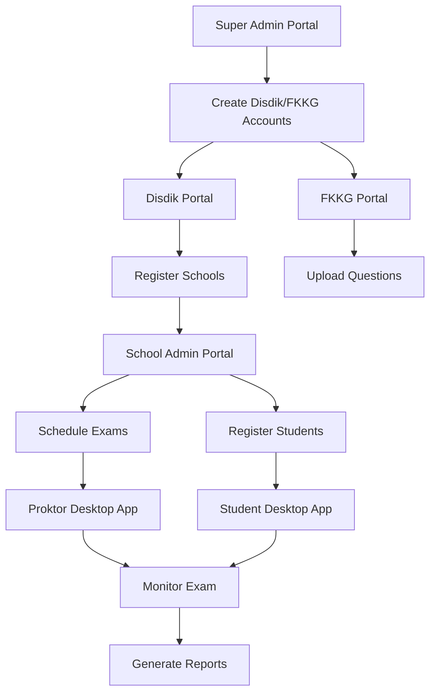

## 1. Product Overview
Sistem Tes Kemampuan Akademik (TKA) adalah platform digital untuk mengelola dan melaksanakan ujian akademik secara online dengan multi-level akses admin dan aplikasi desktop untuk pengawas serta peserta ujian. Sistem ini dirancang untuk mendukung 5000+ concurrent users dengan arsitektur terdistribusi.

Platform ini menyelesaikan permasalahan pengelolaan ujian skala besar, memungkinkan Disdik, FKKG, dan admin sekolah untuk mengelola ujian secara terpusus, sementara proktor dapat mengawasi secara real-time melalui aplikasi desktop.

## 2. Core Features

### 2.1 User Roles
| Role | Registration Method | Core Permissions |
|------|---------------------|------------------|
| Super Admin | Manual setup by system | Full system access, manage all portals, system configuration |
| Disdik Admin | Super Admin invitation | Manage schools, exams, view reports across regions |
| FKKG Admin | Super Admin invitation | Manage exam questions, validation, quality control |
| School Admin | Disdik Admin invitation | Manage students, schedule exams, view school reports |
| Proktor | School Admin assignment | Monitor exam sessions, control student access |
| Student | School Admin registration | Take exams, view results |

### 2.2 Feature Module
Sistem TKA terdiri dari portal-portal berikut:
1. **Portal Super Admin**: Dashboard sistem, manajemen user, konfigurasi sistem, monitoring performa
2. **Portal Disdik**: Manajemen sekolah, jadwal ujian, laporan regional, analitik data
3. **Portal FKKG**: Bank soal, validasi soal, kurikulum, standar penilaian
4. **Portal Admin Sekolah**: Manajemen siswa, jadwal ujian, laporan sekolah
5. **Aplikasi Desktop Proktor**: Monitoring ujian real-time, kontrol akses, deteksi kecurangan
6. **Aplikasi Client Siswa**: Interface ujian, timer, pengumpulan jawaban

### 2.3 Page Details
| Page Name | Module Name | Feature description |
|-----------|-------------|---------------------|
| Super Admin Dashboard | System Overview | View total users, active exams, system health, performance metrics |
| Super Admin Dashboard | User Management | Create/edit/disable accounts for Disdik, FKKG, and School admins |
| Super Admin Dashboard | System Configuration | Set exam parameters, backup settings, notification preferences |
| Disdik Dashboard | Regional Overview | View all schools, total students, exam schedules in region |
| Disdik Dashboard | School Management | Add/edit schools, assign school admins, set school quotas |
| Disdik Dashboard | Exam Scheduling | Create exam schedules, assign schools, set duration and rules |
| Disdik Dashboard | Reports | Generate regional performance reports, export data, analytics |
| FKKG Dashboard | Question Bank | Upload, categorize, and manage exam questions by subject |
| FKKG Dashboard | Question Validation | Review and approve questions, set difficulty levels |
| FKKG Dashboard | Curriculum Management | Map questions to curriculum standards, update guidelines |
| School Admin Dashboard | Student Management | Register students, assign to exam sessions, manage profiles |
| School Admin Dashboard | Exam Sessions | Schedule exams for students, assign proctors, set rooms |
| School Admin Dashboard | School Reports | View student performance, exam results, attendance |
| Proktor App | Exam Monitoring | Real-time view of all students, screen monitoring, status tracking |
| Proktor App | Session Control | Start/pause exams, handle technical issues, emergency stops |
| Proktor App | Cheating Detection | AI-powered behavior detection, flag suspicious activities |
| Student App | Exam Interface | Display questions, answer input, navigation between questions |
| Student App | Timer & Status | Show remaining time, question status, submission warnings |
| Student App | Answer Submission | Auto-save answers, final submission, confirmation dialog |

## 3. Core Process

### Super Admin Flow
Super Admin login → Configure system parameters → Create Disdik/FKKG accounts → Monitor system performance → Generate system-wide reports

### Disdik Admin Flow
Disdik login → Register schools → Create exam schedules → Assign schools → Monitor regional exams → Generate regional reports

### FKKG Admin Flow
FKKG login → Upload question banks → Validate and categorize questions → Set exam standards → Review question analytics

### School Admin Flow
School Admin login → Register students → Schedule exam sessions → Assign proctors → Monitor school exams → Generate school reports

### Proktor Flow
Proktor login → Select exam session → Start monitoring → Control exam timing → Handle incidents → Generate session reports

### Student Flow
Student login → Verify identity → Join exam session → Complete exam → Submit answers → View results (if enabled)

## 4. User Interface Design

### 4.1 Design Style
- **Primary Colors**: Blue (#1E40AF) for primary actions, Green (#059669) for success states
- **Secondary Colors**: Gray (#6B7280) for secondary text, Red (#DC2626) for errors
- **Button Style**: Rounded corners (8px radius), clear hover states, loading indicators
- **Typography**: Inter font family, 14px base size, clear hierarchy
- **Layout**: Card-based design, consistent spacing (8px grid system)
- **Icons**: Heroicons for consistency, clear visual metaphors

### 4.2 Page Design Overview
| Page Name | Module Name | UI Elements |
|-----------|-------------|-------------|
| Super Admin Dashboard | System Overview | Metric cards with KPIs, real-time charts, system status indicators |
| Disdik Dashboard | Regional Overview | Interactive map, school statistics, exam calendar widget |
| FKKG Dashboard | Question Bank | Data table with filters, drag-drop upload, categorization sidebar |
| School Admin Dashboard | Student Management | Searchable table, bulk actions, import/export buttons |
| Proktor App | Exam Monitoring | Grid view of student screens, status badges, alert notifications |
| Student App | Exam Interface | Clean question display, progress indicator, timer overlay |

### 4.3 Responsiveness
Desktop-first design approach dengan mobile-adaptive breakpoints:
- Desktop: 1280px+ (optimal experience)
- Tablet: 768px - 1279px (adaptive layout)
- Mobile: < 768px (simplified interface for essential features)

Touch interaction optimization untuk tablet mode pada aplikasi proktor dan student.

### 4.4 Performance Requirements
- Load time < 3 detik untuk semua portal
- Support 5000+ concurrent users
- Real-time sync dengan latency < 100ms
- Auto-save setiap 30 detik untuk jawaban siswa
- Offline mode untuk aplikasi desktop dengan sync saat koneksi ters