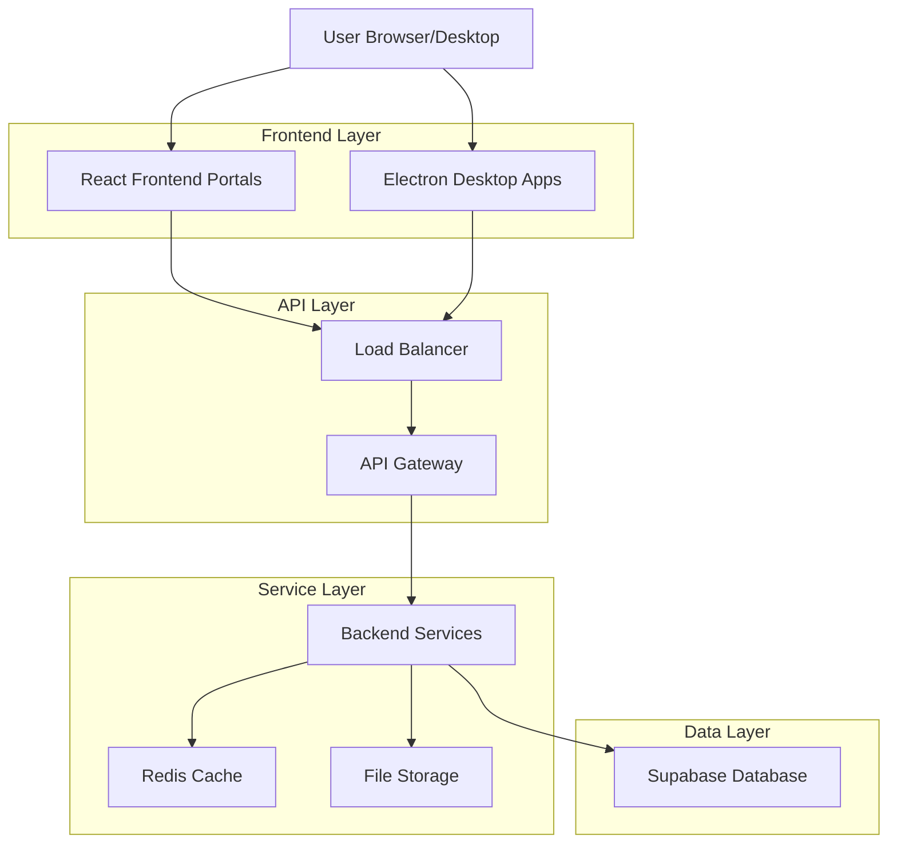
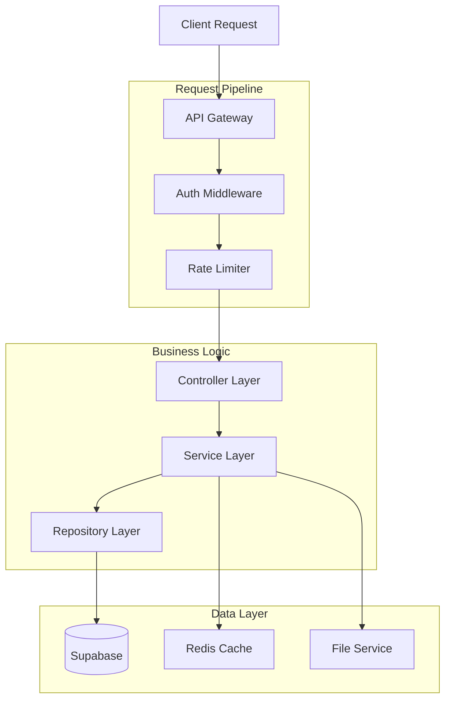
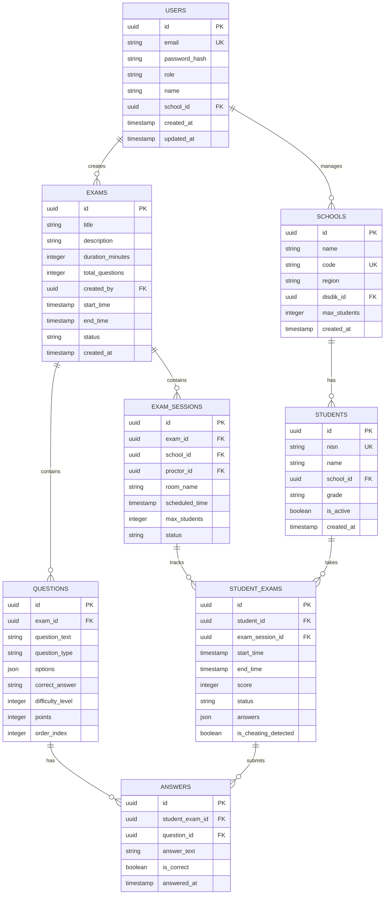

## 1. Architecture Design



## 2. Technology Description

- **Frontend Portals**: React@18 + TypeScript + TailwindCSS@3 + Vite
- **Desktop Apps**: Electron@27 + React@18 + TypeScript
- **Initialization Tool**: vite-init
- **Backend**: Node.js@20 + Express@4 + TypeScript
- **Database**: Supabase (PostgreSQL@15)
- **Cache**: Redis@7
- **Real-time**: Socket.io@4
- **File Storage**: Supabase Storage
- **State Management**: Zustand
- **UI Components**: HeadlessUI + Radix UI

## 3. Route Definitions

| Route | Purpose |
|-------|---------|
| /super-admin | Super Admin dashboard and system management |
| /disdik | Disdik portal for regional management |
| /fkkg | FKKG portal for question bank management |
| /school-admin | School admin portal for student management |
| /login | Unified login page with role detection |
| /api/auth/* | Authentication endpoints |
| /api/exams/* | Exam management endpoints |
| /api/questions/* | Question bank endpoints |
| /api/reports/* | Reporting endpoints |
| /ws/realtime | WebSocket for real-time monitoring |

## 4. API Definitions

### 4.1 Authentication API

```
POST /api/auth/login
```

Request:
| Param Name | Param Type | isRequired | Description |
|------------|------------|------------|-------------|
| email | string | true | User email address |
| password | string | true | Encrypted password |
| role | string | true | User role type |

Response:
| Param Name | Param Type | Description |
|------------|------------|-------------|
| token | string | JWT access token |
| refresh_token | string | JWT refresh token |
| user | object | User profile data |
| permissions | array | User permissions list |

### 4.2 Exam Management API

```
GET /api/exams/schedule
```

Headers:
```
Authorization: Bearer {token}
```

Response:
```json
{
  "exams": [
    {
      "id": "uuid",
      "title": "TKA Regional Test",
      "start_time": "2024-01-15T08:00:00Z",
      "duration": 120,
      "student_count": 150,
      "status": "scheduled"
    }
  ]
}
```

### 4.3 Real-time Monitoring API

```
WebSocket: /ws/realtime
```

Events:
- `student_joined`: Student joined exam session
- `student_status`: Student status update
- `exam_control`: Proktor control commands
- `alert_triggered`: Cheating detection alert

## 5. Server Architecture Diagram



## 6. Data Model

### 6.1 Database Schema



### 6.2 Data Definition Language

```sql
-- Users table
CREATE TABLE users (
    id UUID PRIMARY KEY DEFAULT gen_random_uuid(),
    email VARCHAR(255) UNIQUE NOT NULL,
    password_hash VARCHAR(255) NOT NULL,
    role VARCHAR(50) NOT NULL CHECK (role IN ('super_admin', 'disdik', 'fkkg', 'school_admin', 'proctor')),
    name VARCHAR(255) NOT NULL,
    school_id UUID REFERENCES schools(id),
    created_at TIMESTAMP WITH TIME ZONE DEFAULT NOW(),
    updated_at TIMESTAMP WITH TIME ZONE DEFAULT NOW()
);

-- Schools table
CREATE TABLE schools (
    id UUID PRIMARY KEY DEFAULT gen_random_uuid(),
    name VARCHAR(255) NOT NULL,
    code VARCHAR(50) UNIQUE NOT NULL,
    region VARCHAR(100) NOT NULL,
    disdik_id UUID REFERENCES users(id),
    max_students INTEGER DEFAULT 500,
    created_at TIMESTAMP WITH TIME ZONE DEFAULT NOW()
);

-- Students table
CREATE TABLE students (
    id UUID PRIMARY KEY DEFAULT gen_random_uuid(),
    nisn VARCHAR(20) UNIQUE NOT NULL,
    name VARCHAR(255) NOT NULL,
    school_id UUID REFERENCES schools(id) ON DELETE CASCADE,
    grade VARCHAR(10),
    is_active BOOLEAN DEFAULT true,
    created_at TIMESTAMP WITH TIME ZONE DEFAULT NOW()
);

-- Exams table
CREATE TABLE exams (
    id UUID PRIMARY KEY DEFAULT gen_random_uuid(),
    title VARCHAR(255) NOT NULL,
    description TEXT,
    duration_minutes INTEGER NOT NULL,
    total_questions INTEGER NOT NULL,
    created_by UUID REFERENCES users(id),
    start_time TIMESTAMP WITH TIME ZONE,
    end_time TIMESTAMP WITH TIME ZONE,
    status VARCHAR(50) DEFAULT 'draft' CHECK (status IN ('draft', 'scheduled', 'active', 'completed', 'cancelled')),
    created_at TIMESTAMP WITH TIME ZONE DEFAULT NOW()
);

-- Exam Sessions table
CREATE TABLE exam_sessions (
    id UUID PRIMARY KEY DEFAULT gen_random_uuid(),
    exam_id UUID REFERENCES exams(id) ON DELETE CASCADE,
    school_id UUID REFERENCES schools(id) ON DELETE CASCADE,
    proctor_id UUID REFERENCES users(id),
    room_name VARCHAR(100),
    scheduled_time TIMESTAMP WITH TIME ZONE,
    max_students INTEGER DEFAULT 30,
    status VARCHAR(50) DEFAULT 'scheduled' CHECK (status IN ('scheduled', 'active', 'completed', 'cancelled')),
    created_at TIMESTAMP WITH TIME ZONE DEFAULT NOW()
);

-- Questions table
CREATE TABLE questions (
    id UUID PRIMARY KEY DEFAULT gen_random_uuid(),
    exam_id UUID REFERENCES exams(id) ON DELETE CASCADE,
    question_text TEXT NOT NULL,
    question_type VARCHAR(50) NOT NULL CHECK (question_type IN ('multiple_choice', 'essay', 'true_false')),
    options JSONB,
    correct_answer TEXT,
    difficulty_level INTEGER CHECK (difficulty_level BETWEEN 1 AND 5),
    points INTEGER DEFAULT 1,
    order_index INTEGER,
    created_at TIMESTAMP WITH TIME ZONE DEFAULT NOW()
);

-- Student Exams table
CREATE TABLE student_exams (
    id UUID PRIMARY KEY DEFAULT gen_random_uuid(),
    student_id UUID REFERENCES students(id) ON DELETE CASCADE,
    exam_session_id UUID REFERENCES exam_sessions(id) ON DELETE CASCADE,
    start_time TIMESTAMP WITH TIME ZONE,
    end_time TIMESTAMP WITH TIME ZONE,
    score INTEGER,
    status VARCHAR(50) DEFAULT 'scheduled' CHECK (status IN ('scheduled', 'in_progress', 'completed', 'absent')),
    answers JSONB DEFAULT '{}',
    is_cheating_detected BOOLEAN DEFAULT false,
    created_at TIMESTAMP WITH TIME ZONE DEFAULT NOW()
);

-- Performance indexes
CREATE INDEX idx_users_email ON users(email);
CREATE INDEX idx_users_school_id ON users(school_id);
CREATE INDEX idx_students_nisn ON students(nisn);
CREATE INDEX idx_students_school_id ON students(school_id);
CREATE INDEX idx_exams_status ON exams(status);
CREATE INDEX idx_exam_sessions_school_id ON exam_sessions(school_id);
CREATE INDEX idx_exam_sessions_exam_id ON exam_sessions(exam_id);
CREATE INDEX idx_student_exams_student_id ON student_exams(student_id);
CREATE INDEX idx_student_exams_session_id ON student_exams(exam_session_id);

-- Row Level Security (RLS) Policies
ALTER TABLE users ENABLE ROW LEVEL SECURITY;
ALTER TABLE schools ENABLE ROW LEVEL SECURITY;
ALTER TABLE students ENABLE ROW LEVEL SECURITY;
ALTER TABLE exams ENABLE ROW LEVEL SECURITY;
ALTER TABLE exam_sessions ENABLE ROW LEVEL SECURITY;
ALTER TABLE questions ENABLE ROW LEVEL SECURITY;
ALTER TABLE student_exams ENABLE ROW LEVEL SECURITY;

-- Grant permissions
GRANT SELECT ON users TO anon;
GRANT ALL ON users TO authenticated;
GRANT SELECT ON schools TO anon;
GRANT ALL ON schools TO authenticated;
GRANT SELECT ON students TO anon;
GRANT ALL ON students TO authenticated;
GRANT SELECT ON exams TO anon;
GRANT ALL ON exams TO authenticated;
GRANT SELECT ON exam_sessions TO anon;
GRANT ALL ON exam_sessions TO authenticated;
GRANT SELECT ON questions TO anon;
GRANT ALL ON questions TO authenticated;
GRANT SELECT ON student_exams TO anon;
GRANT ALL ON student_exams TO authenticated;
```

## 7. Performance & Scalability Considerations

### 7.1 Database Optimization
- Implement connection pooling dengan PgBouncer
- Gunakan materialized views untuk report generation
- Partition tables untuk student_exams berdasarkan waktu
- Implement read replicas untuk reporting queries

### 7.2 Caching Strategy
- Redis untuk session management dan real-time data
- CDN untuk static assets dan question images
- Browser caching untuk exam interface

### 7.3 Load Testing Plan
- Test scenario: 5000 concurrent users taking exams
- Gradual ramp-up: 500 users per 30 seconds
- Monitor metrics: Response time < 2s, Error rate < 1%
- Load testing tools: K6 atau JMeter

### 7.4 Security Measures
- JWT tokens dengan refresh mechanism
- Rate limiting per endpoint
- Input validation dan sanitization
- Encrypted data transmission (HTTPS/WSS)
- Audit logging untuk