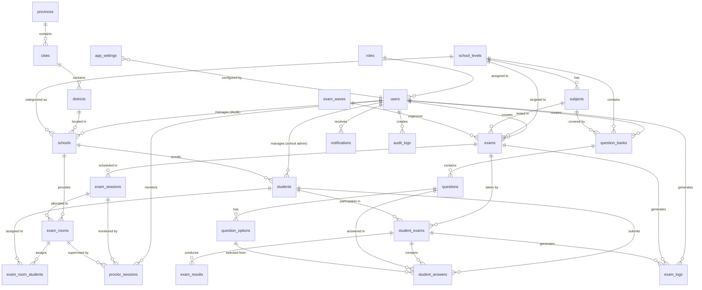

# 📊 TKA Database - Entity Relationship Diagram

## 🎯 Overview
Database schema untuk Sistem Tes Kemampuan Akademik dengan 21 tabel utama yang mendukung fitur multi-role user, exam management, real-time proctoring, dan comprehensive audit logging.

## 🏗️ Entity Relationship Diagram

## 📋 Entity Details

### 1. User Management & Authentication

#### `roles`
Tabel master untuk Role-Based Access Control (RBAC)
- **Fields**: id, name, description, permissions (JSONB), is_active
- **Relationships**: One-to-Many dengan users
- **Indexes**: UNIQUE(name)

#### `users`
Tabel utama untuk semua pengguna sistem (6 role)
- **Fields**: id, email, password_hash, name, role_id, avatar_url, phone, is_active, email_verified, last_login_at
- **Relationships**: 
  - Many-to-One dengan roles
  - One-to-Many dengan schools (untuk Disdik)
  - One-to-Many dengan students (untuk School Admin)
  - One-to-Many dengan exams, question_banks, notifications
- **Indexes**: UNIQUE(email), idx_users_role_id, idx_users_is_active

### 2. Regional Structure

#### `provinces`, `cities`, `districts`
Struktur wilayah Indonesia untuk alamat sekolah
- **Hierarchical**: provinces → cities → districts → schools
- **Fields**: id, code (unique), name, parent_id, type, is_active
- **Relationships**: One-to-Many dengan child entities

### 3. School Management

#### `school_levels`
Jenjang pendidikan: SD, SMP, SMA, SMK, MA
- **Fields**: id, code, name, description, is_active

#### `schools`
Data sekolah dengan NPSN
- **Fields**: id, npsn (unique), name, school_level_id, address, contact info, disdik_user_id
- **Relationships**: 
  - Many-to-One dengan school_levels, provinces, cities, districts
  - Many-to-One dengan users (Disdik responsible)
  - One-to-Many dengan students, exam_rooms
- **Indexes**: UNIQUE(npsn), idx_schools_disdik_user_id

### 4. Student Management

#### `students`
Data siswa dengan NISN
- **Fields**: id, nisn (unique), nis, name, email, school_id, class, major, gender, birth_info, address, photo_url
- **Relationships**: 
  - Many-to-One dengan schools
  - One-to-Many dengan exam_room_students, student_exams
- **Indexes**: UNIQUE(nisn), idx_students_school_id, idx_students_email

### 5. Academic Structure

#### `subjects`
Mata pelajaran per jenjang sekolah
- **Fields**: id, code (unique), name, description, school_level_id
- **Relationships**: One-to-Many dengan question_banks, exams

#### `question_banks`
Bank soal per mata pelajaran
- **Fields**: id, code (unique), name, description, subject_id, school_level_id, created_by
- **Relationships**: 
  - Many-to-One dengan subjects, school_levels, users
  - One-to-Many dengan questions

### 6. Question Management

#### `questions`
Soal individual dengan berbagai tipe
- **Fields**: id, question_bank_id, question_text, question_type, difficulty_level, score, media URLs, explanation
- **Relationships**: 
  - Many-to-One dengan question_banks
  - One-to-Many dengan question_options, student_answers
- **Indexes**: idx_questions_question_bank_id, idx_questions_question_type

#### `question_options`
Pilihan jawaban untuk soal pilihan ganda
- **Fields**: id, question_id, option_label, option_text, is_correct, order_number, image_url
- **Relationships**: Many-to-One dengan questions, student_answers

### 7. Exam Management

#### `exam_waves`
Gelombang ujian (contoh: Gelombang 1, 2, 3)
- **Fields**: id, code (unique), name, description, date range, registration period, created_by
- **Relationships**: One-to-Many dengan exams

#### `exams`
Ujian dengan jadwal dan konfigurasi
- **Fields**: id, code (unique), title, description, exam_wave_id, subject_id, duration, scoring, configuration flags, status
- **Relationships**: 
  - Many-to-One dengan exam_waves, subjects, school_levels, users
  - One-to-Many dengan exam_sessions, student_exams, exam_logs
- **Indexes**: idx_exams_exam_wave_id, idx_exams_subject_id, idx_exams_status, idx_exams_start_datetime

#### `exam_sessions`
Sesi ujian dengan kapasitas dan jadwal
- **Fields**: id, exam_id, session_name, datetime range, max_students, status, created_by
- **Relationships**: 
  - Many-to-One dengan exams, users
  - One-to-Many dengan exam_rooms, proctor_sessions

#### `exam_rooms`
Ruang ujian dengan proktor assignment
- **Fields**: id, exam_session_id, room_name, room_code (unique), max_capacity, proctor_id, location, computer_count, status
- **Relationships**: 
  - Many-to-One dengan exam_sessions, users (proctor)
  - One-to-Many dengan exam_room_students, proctor_sessions
- **Indexes**: UNIQUE(room_code)

### 8. Exam Execution

#### `exam_room_students`
Mapping siswa ke ruang ujian
- **Fields**: id, exam_room_id, student_id, seat_number, computer_number, status, check_in/out times
- **Relationships**: Many-to-One dengan exam_rooms, students
- **Constraints**: UNIQUE(exam_room_id, student_id)

#### `student_exams`
Status dan progress ujian siswa
- **Fields**: id, student_id, exam_id, exam_room_id, timing, status, progress counters, score, network info
- **Relationships**: 
  - Many-to-One dengan students, exams, exam_rooms
  - One-to-Many dengan student_answers, exam_results, exam_logs
- **Constraints**: UNIQUE(student_id, exam_id)
- **Indexes**: idx_student_exams_student_id, idx_student_exams_exam_id, idx_student_exams_status

#### `student_answers`
Jawaban siswa per soal
- **Fields**: id, student_exam_id, question_id, answer_text, answer_option_id, is_correct, score, timing
- **Relationships**: 
  - Many-to-One dengan student_exams, questions, question_options
- **Constraints**: UNIQUE(student_exam_id, question_id)

#### `exam_results`
Hasil akhir ujian siswa
- **Fields**: id, student_exam_id, scoring details, grade, passed status, ranking, percentile, certificate_url, result_details (JSONB)
- **Relationships**: One-to-One dengan student_exams

### 9. Proctoring & Monitoring

#### `proctor_sessions`
Sesi pengawasan ujian oleh proktor
- **Fields**: id, exam_room_id, proctor_id, session timing, monitoring stats, notes, status
- **Relationships**: 
  - Many-to-One dengan exam_rooms, users (proctor)

#### `exam_logs`
Log aktivitas ujian untuk audit dan monitoring
- **Fields**: id, student_exam_id, user_id, exam_id, log_type, message, log_data (JSONB), network info, severity
- **Relationships**: 
  - Many-to-One dengan student_exams, users, exams
- **Indexes**: Multiple indexes untuk query performance

### 10. System Management

#### `notifications`
Sistem notifikasi untuk users
- **Fields**: id, user_id, title, message, type, priority, read status, action URLs, expiration
- **Relationships**: Many-to-One dengan users
- **Indexes**: idx_notifications_user_id, idx_notifications_is_read, idx_notifications_created_at

#### `app_settings`
Konfigurasi aplikasi
- **Fields**: id, setting_key (unique), setting_value, setting_type, description, category, access flags, created_by
- **Relationships**: Many-to-One dengan users (creator)

### 11. Audit & Compliance

#### `audit_logs`
Audit trail untuk semua perubahan data
- **Fields**: id, table_name, record_id, action, old/new values (JSONB), changed_by, network info, timestamp
- **Relationships**: Many-to-One dengan users (changer)
- **Indexes**: Multiple indexes untuk audit queries

## 🔑 Key Design Decisions

### 1. UUID Primary Keys
- **Alasan**: Global uniqueness, security (tidak sequential), scalable untuk distributed systems
- **Performance**: Index performance tetap optimal dengan proper indexing

### 2. JSONB Fields
- **permissions** (roles): Flexible RBAC configuration
- **log_data** (exam_logs): Dynamic logging data
- **result_details** (exam_results): Detailed result breakdown
- **old/new_values** (audit_logs): Flexible audit trail

### 3. Soft Delete Pattern
- **is_active flags**: Mempertahankan data history untuk audit
- **status fields**: Status tracking untuk workflow management
- **timestamp tracking**: created_at, updated_at untuk audit trail

### 4. Performance Optimization
- **Strategic Indexing**: 25+ indexes untuk query performance
- **Composite Indexes**: Untuk complex queries
- **Partitioning Ready**: Structure siap untuk table partitioning jika data besar

### 5. Security & Compliance
- **RLS Ready**: Row Level Security preparation
- **Audit Trail**: Comprehensive audit logging
- **Data Encryption**: Siap untuk field-level encryption
- **Access Control**: RBAC dengan granular permissions

## 📈 Scalability Considerations

### Untuk 5000+ Concurrent Users:
1. **Database Partitioning**: Partition by exam_wave_id atau date ranges
2. **Read Replicas**: Replica untuk read-heavy operations
3. **Caching Strategy**: Redis untuk frequently accessed data
4. **Connection Pooling**: Proper connection pool configuration
5. **Query Optimization**: Indexed queries dan prepared statements

### Performance Targets:
- **Query Response**: < 100ms untuk simple queries
- **Complex Queries**: < 500ms untuk report generation
- **Concurrent Connections**: Support 1000+ concurrent database connections
- **Data Growth**: Handle 10M+ records per tahun

## 🔍 Next Steps

1. **Implementasi RLS Policies** berdasarkan user roles
2. **Setup Database Partitioning** untuk scalability
3. **Configure Read Replicas** untuk performance
4. **Setup Automated Backups** untuk disaster recovery
5. **Implement Data Retention Policies** untuk compliance

---

**Database Schema siap untuk support 5000+ concurrent users dengan proper indexing dan optimization strategies.**